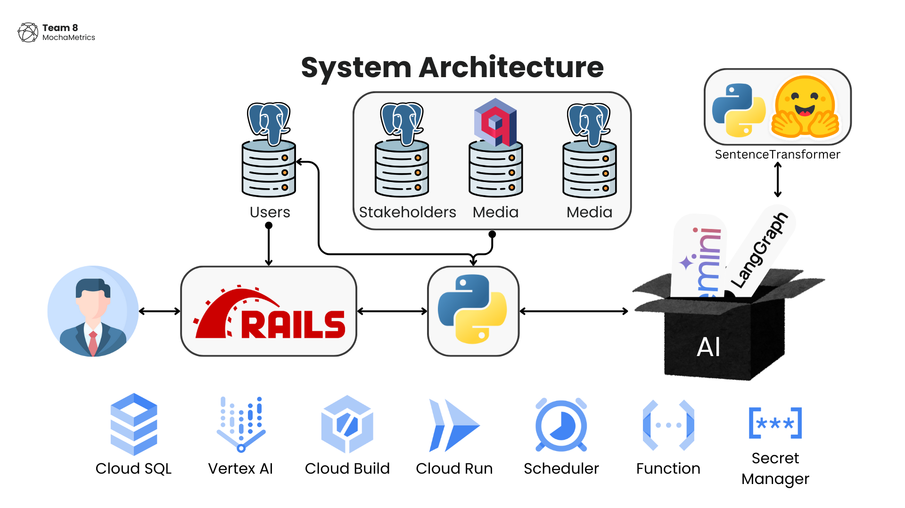
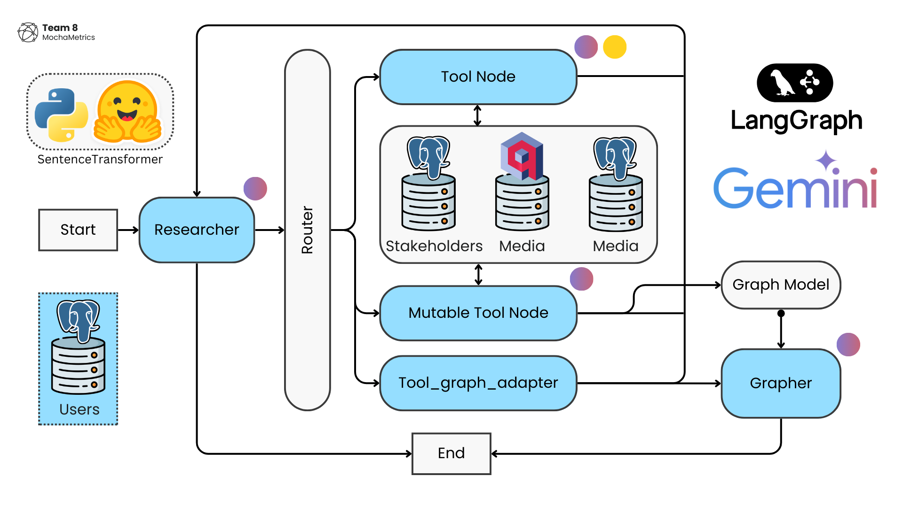

<details>
  <summary>Table of Contents</summary>
  <ol>
    <li>
      <a href="#about-the-project">About The Project</a>
      <ul>
        <li><a href="#built-with">Built With</a></li>
      </ul>
    </li>
    <li>
      <a href="#getting-started">Getting Started</a>
      <ul>
        <li><a href="#prerequisites">Prerequisites</a></li>
        <li><a href="#installation">Installation</a></li>
      </ul>
    </li>
    <li><a href="#usage">Usage</a></li>
    <li><a href="#roadmap">Roadmap</a></li>
    <li><a href="#contributing">Contributing</a></li>
    <li><a href="#license">License</a></li>
    <li><a href="#contact">Contact</a></li>
    <li><a href="#acknowledgments">Acknowledgments</a></li>
  </ol>
</details>

# Global Influence Insight: Natural Language Business Intelligence Assistant 
This project was done in collaboration with The Stakeholder Company (TSC). Using data scraped from the internet or bought through various sources, we are able to leverage the power of LLMs (notably Google Gemini) to provide powerful insights from our data. 


## Features 
* Store different chat with chat history for different users 
* Query database on stakeholder information with fuzzy matching (for names)
* Draw network graphs that connect different stakeholders 
* Draw insights from media and piece together connections 

## UX Design 
We made the interface similar to the familiar ChatGPT that everyone knows as familiar designs are more likely to be easily understood and navigated by the user. Since we are making something similar to a chatbot, we want the users to quickly understand that. 

## Problem Statement 
How can we streamline information collection and report generation to reduce the time and effort required by the users?

## Project Architecture 

The overall architectureof the project. 


How the AI works on the Python server. 


ER diagram for Users DB. 


ER diagram for Stakeholders DB. 


ER diagram for Media DB. 

### Technologies Used


The main web page is served by a Ruby on Rails server, while all the processing is done on a separate server written in Python. For the rest of the Readme, we will use the terms Rails server and Python server. 

Due to the heavy emphasis on AI, we choose to use LangChain and LangGraph to simplify our process. Both LangChain and LangGraph are primarily written in Python, with minimal support written in Ruby. Therefore, we chose to take advantage of these 2 libraries and write our main AI processing server in Python. The Python server then provides an API endpoint with FastAPI for the Rails server to interact with. 

### LangGraph 
[LangGraph](https://langchain-ai.github.io/langgraph/) is a library for building stateful, multi-actor applications with LLMs, used to create agent and multi-agent workflows.

### Ruby on Rails
[Rails](https://guides.rubyonrails.org/getting_started.html) is a web application development framework written in the Ruby programming language. It is designed to make programming web applications easier by making assumptions about what every developer needs to get started.

Rails is opinionated software. It makes the assumption that there is a "best" way to do things, and it's designed to encourage that way - and in some cases to discourage alternatives.

## How the AI works 
Based on the overall architecture diagram above, the AI processing consists of Researcher (Agent), Router, Call Tools and Graph Master. 
Agent is a Runnable that can Calls Tools 
Upon receiving the user's input at the `/langchain/` endpoint, there are 2 possible user flows that can happen. In both cases, we are taking in a natural language prompt and outputing some message for the user. The exact user flows are described below. 

### Non Graph Flow 
Example prompt: 

> Tell me more about Ben Carson 

1. User Query received at `/langchain/` endpoint. 
2. Extract arguments + tools to use 
3. Go to Router, then Call Tools. 
4. Execute tool function, which outputs a Tool Message 
5. Goes back to Researcher. 
6. Repeat Steps 3 - 5 until the Agent 

### Graph Flow 
Example prompt

> Help me generate a graph on the relationships of Joe Biden.


### Checkpoints 
[Checkpoints](https://langchain-ai.github.io/langgraph/reference/checkpoints/) is the LangChain way of giving your agent  "memory" by persisting its state. With this, the agent is able to use previous messages context to craft the next response. 

# Demo 
Insert youtube demo here 

# Getting Started 
This project requires both Ruby, with Ruby on Rails and Python to work. 

Clone the repo and open 2 separate terminal windows, one for the Rails server and one for the Python server. ```cd``` into the respective folders. 

## Rails Server 

Install all dependencies for Rails. Please change the path according to where you cloned the repo. 
```sh
bundle install --gemfile /path_to_repo/1d-final-project-summer-2024-sds-2024-team-08/rails-server/Gemfile
```

Start Rails server
```sh
rails s 
```

(Optional) If you are developing Rails locally with Postgres database in cloud, download cloud SQL proxy to allow Rails to connect to the cloud db. Follow this guide [here](https://cloud.google.com/sql/docs/mysql/sql-proxy). Run the cloud sql proxy in another terminal at the same time as ```rails s```

## Python Server 

It would be advisable to use a [virtual environment](https://docs.python.org/3/library/venv.html) for the packages required in the Python server to prevent messing up system packages and versions. 

Create a venv for Python packages 
```sh
python3 -m venv .venv  
```

Activate the venv, command depends on OS. 
|Shell|Command to activate venv|
|--|--|
|POSIX bash/zsh |```source  venv/bin/activate``` |
|Windows cmd.exe|```venv\Scripts\activate.bat```|

Install all dependencies for Python server
```sh
pip install -r requirements.txt
```

Start Python server. `uvicorn` is part of the dependencies installed when running the above comnand.  
```sh
uvicorn —app-dir app —host 0.0.0.0 —port 8080 main:app
```

### Postgres Database 
We are using a Postgres database for both development and production. The production version is set up on Google Cloud, see below for more details. 

To create a new database in Google Cloud:
1. Log in
2. Navigate to "SQL" from the navigation menu
3. Click on "CREATE INSTANCE"
4. Click on "Choose PostegreSQL"
5. Choose Enterprise. Set to "Deployment". Give your instance a name and a password. Set Region to "asia-east1 (Taiwan)" because we found it to be cheaper. Leave it as "Single Zone". Change Machine Configuration to "2 vCPU, 16GB". Storage to "HDD" and "10GB". Click on "CREATE INSTANCE"
6. In the instance, navigate to "Databases" and click on "Create Database". Enter the database name and click "CREATE"
7. Go to the "Users" tab and click on "ADD USER ACCOUNT". Make sure that "Built-in authentication" is checked. Enter the User name and Password. Click "Add"

Now your PostgreSQL has been created within Google Cloud and is ready to receive data!

# Deployment 


We are using these Google Cloud services. 
* Cloud Build 
* Cloud Run 
* Vertex AI 
* Artifact Registry 
* Cloud SQL 
* Cloud Function (turn on and off the db)
* Cloud Scheduler (calls cloud function)

Follow the steps below to deploy both servers.

## Rails Server
To deploy, run this command in `rails-server/`. The build script is detailed in `rails-server/cloudbuild.yaml`. 

```sh 
gcloud builds submit 
```

## Python Server 
To deploy, run this command in `python-server/`. The build script is detailed in `python-server/cloudbuild.yaml`. 

```sh 
gcloud builds submit 
```

## Auto Deployment with Github Actions 

The auto deploy build steps are described in `.github/workflows/deploy-rails.yml` for Rails server and `.github/workflows/deploy-python.yml` for Python server. 

# Testing 


Written in Cucumber and automated with Capybara. Cucumber is a tool for running automated tests written in plain language. Capybara helps you test web applications by simulating how a real user would interact with your app.

## Rails Server 
Run the tests with this command. 

```sh
bundle exec cucumber 
```

This command will run the file `rails-server/features/index.feature` and `rails-server/features/step_definitions/index.rb`. The Python server endpoint is not mocked as we are doing acceptance testing and that requires the AI output to be correct. 